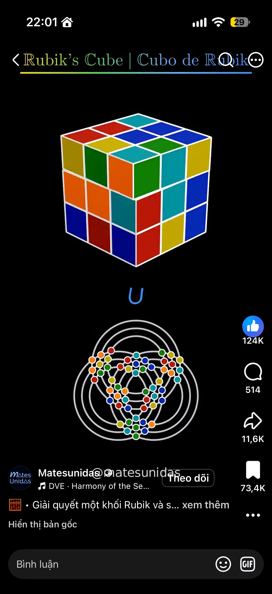

<div align="center">

# Rubik Rings · WebUI Local

**Khối Rubik 3D và sơ đồ 9 vòng tròn giao nhau, chạy offline trong một file HTML.**<br>
**A 3D Rubik's cube and its 9-ring circle diagram, offline in a single HTML file.**

[Tiếng Việt](#tiếng-việt) · [English](#english)

</div>

---

## Tiếng Việt

### Giới thiệu

Rubik Rings vừa là **trò chơi mô phỏng** cho học sinh yêu thích Rubik, vừa là **bài học lập trình** cho người muốn ôn thuật toán.

- **Với học sinh:** xoay khối Rubik 3D bằng chuột, bàn phím hoặc nút bấm, và thấy cùng lúc một góc nhìn mới: 54 ô màu nằm trên **9 vòng tròn đồng tâm giao nhau** (circle puzzle). Ứng dụng ra đề theo cấp độ, có đồng hồ, có bộ giải chỉ từng bước.
- **Với lập trình viên:** mã nguồn TypeScript có test đầy đủ cho mô hình hoán vị, bộ kiểm tra hợp lệ, thuật toán **Kociemba 2 pha**, phương pháp **từng tầng (LBL)** và phép đo khoảng cách **meet-in-the-middle**. Hai bộ giải còn được viết lại bằng **Python, C++, C#, Java, JavaScript**, và lệnh `npm run verify:ref` chứng minh cả 5 cho lời giải giống hệt nhau từng nước.

Sơ đồ vòng tròn là một **biểu diễn đẳng cấu** (isomorphic representation) của nhóm Rubik: mỗi vòng là một lát cắt của khối, mỗi chấm là giao của hai vòng, quay một lớp là trượt các chấm dọc vòng.

<p align="center"><br><sub>Ảnh gợi ý ý tưởng ban đầu (video của Matesunidas).</sub></p>

### Tác giả

| | |
|---|---|
| Ý tưởng và chủ dự án | **Nguyễn Thành Long** · [github.com/tony71200](https://github.com/tony71200) |
|  | **Claude Code** ([Anthropic](https://claude.com/claude-code)), "cộng sự toàn phần": thiết kế, viết spec, kế hoạch, mã nguồn, test và tài liệu cùng tác giả |

### Tính năng

- **Khối 3D (three.js / WebGL).**
  - Kéo nền để xoay góc nhìn, kéo một ô để xoay lớp.
  - Phím `U D R L F B M E S x y z`, Shift để xoay ngược; nút ký hiệu, hoàn tác/làm lại.
- **Sơ đồ 9 vòng (SVG).** Đồng bộ hai chiều với khối 3D; bấm vào vòng để xoay lớp tương ứng.
- **Tab "Ra đề".**
  - 5 cấp theo khoảng cách thật tới đích: Làm quen 1–2, Dễ 3–5, Trung bình 6–9, Khó ≥ 10 (đã chứng minh), Chuyên gia (ngẫu nhiên kiểu WCA).
  - 3 kiểu luyện giai đoạn: PLL, OLL+PLL, F2L+LL.
  - Đồng hồ và bộ đếm nước. Không bao giờ ra đề không giải được.
- **Tab "Giải".**
  - Tô màu trên lưới chữ thập; kiểm tra hợp lệ với lỗi cụ thể (góc bị vặn, cạnh bị lật, hai khối bị tráo…).
  - Giải "Ngắn nhất" (Kociemba, ≤ 21 nước) hoặc "Từng tầng" (LBL, 7 giai đoạn có giải thích).
  - Phát lại từng bước, chỉnh tốc độ.
- **Tab "Thuật toán".** 6 bài giải thích song ngữ, code của 5 ngôn ngữ cắt thẳng từ bản chạy thật, nút tải file đầy đủ.
- **Chung.** Tiếng Việt / English, giao diện sáng / tối, chạy offline hoàn toàn từ một file `dist/index.html` (khoảng 1,1 MB).

### Yêu cầu phiên bản

| Thành phần | Phiên bản | Cần khi nào |
|---|---|---|
| Microsoft Edge hoặc Google Chrome | bản hiện hành, có WebGL 2 | luôn luôn (chạy ứng dụng) |
| Node.js | **≥ 22.12** (đã thử 22.14) | build lần đầu và khi phát triển |
| npm | ≥ 10 (đi kèm Node.js) | như trên |
| Git | bất kỳ | nếu tải bằng `git clone` |
| Python | ≥ 3.12 | chỉ cho `npm run verify:ref` |
| g++ (hoặc clang++ trên macOS) | hỗ trợ C++17 (đã thử GCC 15.2) | chỉ cho `npm run verify:ref` |
| .NET SDK | 9 | chỉ cho `npm run verify:ref` |
| JDK | ≥ 11 | chỉ cho `npm run verify:ref` |

Firefox và Safari chưa được kiểm thử.

### Tải về

Dùng Git:

```bash
git clone https://github.com/tony71200/WebUI_Local_Rubik.git
```

Hoặc không cần Git: vào [github.com/tony71200/WebUI_Local_Rubik](https://github.com/tony71200/WebUI_Local_Rubik), bấm **Code → Download ZIP**, rồi giải nén.

### Cài đặt và chạy

Lần đầu, file mở nhanh sẽ tự cài thư viện (`npm ci`), build (`npm run build`), rồi mở `dist/index.html` bằng trình duyệt mặc định. Từ lần sau, nó mở ngay. Sau khi cập nhật mã nguồn (`git pull`), chạy file kèm tham số `rebuild` để build lại.

#### Windows

1. Cài Node.js 22.12+ từ [nodejs.org](https://nodejs.org), hoặc chạy:
   ```powershell
   winget install OpenJS.NodeJS.LTS
   ```
2. Mở thư mục dự án và **double-click `run-windows.bat`**. Để build lại sau khi cập nhật:
   ```powershell
   .\run-windows.bat rebuild
   ```

#### Linux

1. Cài Node.js 22.12+, khuyên dùng [nvm](https://github.com/nvm-sh/nvm):
   ```bash
   nvm install 22
   ```
2. Trong thư mục dự án:
   ```bash
   chmod +x run-linux.sh
   ```
   ```bash
   ./run-linux.sh
   ```
   Thêm tham số `rebuild` để build lại. Nếu máy không có `xdg-open`, script sẽ in đường dẫn file để bạn mở bằng Chrome hoặc Edge.

#### macOS

1. Cài Node.js 22.12+ bằng [Homebrew](https://brew.sh):
   ```bash
   brew install node
   ```
2. **Double-click `run-macos.command`** trong Finder, hoặc trong Terminal:
   ```bash
   ./run-macos.command
   ```
   Nếu macOS chặn file vừa tải về, bấm chuột phải vào file → **Open**, hoặc chạy:
   ```bash
   xattr -d com.apple.quarantine run-macos.command
   ```
   Nếu file mất quyền chạy (thường gặp khi tải ZIP):
   ```bash
   chmod +x run-macos.command
   ```

> File `dist/index.html` là bản hoàn chỉnh, chạy độc lập: bạn có thể chép riêng nó sang máy khác và mở bằng double-click, không cần Node.js.

### Dành cho lập trình viên

| Lệnh | Việc làm |
|---|---|
| `npm ci` | cài đúng phiên bản thư viện theo `package-lock.json` |
| `npm run dev` | chạy dev server Vite (tự tải lại khi sửa code) |
| `npm test` | chạy toàn bộ test Vitest (90 test) |
| `npm run typecheck` | kiểm tra kiểu TypeScript |
| `npm run build` | typecheck + build ra `dist/index.html` |
| `npm run verify:ref` | chạy bộ giải TypeScript và 5 bản Python/C++/C#/Java/JS trên 30 khối mẫu; tất cả phải in đúng `reference/expected.txt` (khoảng 1 phút) |
| `npm run fixtures` | sinh lại `reference/fixtures.txt` và `expected.txt` từ bản TypeScript (chỉ khi cố ý đổi bộ giải) |

Bản đồ mã nguồn:

- `src/core/`: mô hình facelet và cubie, hoán vị nước đi, phép chiếu 9 vòng
- `src/solver/`: Kociemba 2 pha và LBL, chạy trong Web Worker
- `src/scramble/`: đo khoảng cách và sinh đề
- `src/view/`: khối 3D và sơ đồ vòng
- `src/ui/`: các tab, giao diện, song ngữ, theme
- `reference/`: 5 bản cài đặt mẫu
- `scripts/`: sinh fixtures, `verify:ref`, plugin trích code

Tài liệu dự án:
- Luật cho agent: [AGENTS.md](AGENTS.md); bối cảnh: [CLAUDE.md](CLAUDE.md); hệ thiết kế: [DESIGN.md](DESIGN.md).
- Đặc tả: [docs/superpowers/specs/](docs/superpowers/specs/); 4 kế hoạch triển khai: [docs/superpowers/plans/](docs/superpowers/plans/).

### Nguồn đã sử dụng

Thư viện và công cụ:
- three.js: https://threejs.org
- TypeScript: https://www.typescriptlang.org
- Vite: https://vite.dev
- vite-plugin-singlefile: https://github.com/richardtallent/vite-plugin-singlefile
- Vitest: https://vitest.dev
- Shiki: https://shiki.style

Phông chữ và công cụ phát triển:
- Be Vietnam Pro (Fontsource): https://fontsource.org/fonts/be-vietnam-pro
- JetBrains Mono (Fontsource): https://fontsource.org/fonts/jetbrains-mono
- Claude Code: https://claude.com/claude-code
- Superpowers (quy trình brainstorm, kế hoạch, TDD): https://github.com/obra/superpowers

### Nguồn tham khảo

Thuật toán và toán học:
- Herbert Kociemba, Two-Phase Algorithm (chi tiết cài đặt): https://kociemba.org/math/imptwophase.htm
- God's Number is 20 (Rokicki, Kociemba, Davidson, Dethridge, 2010): https://www.cube20.org
- Rubik's Cube group (Wikipedia): https://en.wikipedia.org/wiki/Rubik%27s_Cube_group
- Optimal solutions for the Rubik's Cube (Wikipedia): https://en.wikipedia.org/wiki/Optimal_solutions_for_the_Rubik%27s_Cube
- Michael Hutchings, The mathematics of Rubik's Cube: https://math.berkeley.edu/~hutching/rubik.pdf
- Ruwix, Beginner's method: https://ruwix.com/the-rubiks-cube/how-to-solve-the-rubiks-cube-beginners-method/

Sơ đồ vòng tròn (circle puzzle):
- MelonGO, rubiks-cube-projection: https://github.com/MelonGO/rubiks-cube-projection
- Lutz Hühnken, Circle Puzzle: https://www.huehnken.de/games/circles/index.html
- SpeedSolving, 2D Rubik's cube: https://www.speedsolving.com/threads/2d-rubiks-cube.89846/

Đề và luyện tập:
- csTimer (đề luyện theo giai đoạn): https://cstimer.net
- CFOP method (Wikipedia): https://en.wikipedia.org/wiki/CFOP_method
- World Cube Association, Regulations: https://www.worldcubeassociation.org/regulations/

Thiết kế giao diện:
- taste-skill: https://github.com/Leonxlnx/taste-skill
- impeccable.style: https://impeccable.style
- awesome-design-md: https://github.com/VoltAgent/awesome-design-md

---

## English

### About

Rubik Rings is both a **puzzle toy** for students who love the Rubik's cube and a **programming lesson** for developers revisiting algorithms.

- **For students:** turn a 3D cube with the mouse, the keyboard or buttons, and see a new view of it at the same time: the 54 stickers sit on **9 intersecting concentric circles** (a circle puzzle). The app hands out puzzles by level, times you, and explains solutions step by step.
- **For developers:** the TypeScript source has tests for:
  - the permutation model and the validator;
  - **Kociemba's two-phase algorithm** and the **layer-by-layer (LBL)** method;
  - **meet-in-the-middle** distance measurement.

  Both solvers are also written in **Python, C++, C#, Java and JavaScript**, and `npm run verify:ref` proves that all five give the same solutions, move for move.

The circle diagram is an **isomorphic representation** of the cube group: each circle is a slice of the cube, each dot is where two circles cross, and turning a layer slides the dots along its circle.

<p align="center"><sub>The original inspiration image (a video by Matesunidas) is shown in the Vietnamese section above.</sub></p>

### Authors

| | |
|---|---|
| Idea and project owner | **Nguyễn Thành Long** · [github.com/tony71200](https://github.com/tony71200) |
|  | **Claude Code** ([Anthropic](https://claude.com/claude-code)), "full partner": design, spec, plans, code, tests and docs together with the author |

### Features

- **3D cube (three.js / WebGL).**
  - Drag the background to orbit, drag a sticker to turn its layer.
  - Keys `U D R L F B M E S x y z`, Shift for counter-clockwise; move buttons, undo/redo.
- **9-ring diagram (SVG).** Synced both ways with the cube; click a circle to turn its layer.
- **Puzzle tab.**
  - 5 levels by true distance to solved: Warm-up 1–2, Easy 3–5, Medium 6–9, Hard ≥ 10 (proved), Expert (WCA-style random state).
  - 3 stage-training modes: PLL, OLL+PLL, F2L+LL.
  - Timer and move counter. Never an unsolvable puzzle.
- **Solve tab.**
  - Paint a cross net; validation with specific errors (twisted corner, flipped edge, swapped pieces…).
  - "Shortest" (Kociemba, ≤ 21 moves) or "Layer by layer" (LBL, 7 explained stages) solutions.
  - Step-by-step playback with speed control.
- **Algorithms tab.** 6 bilingual explanations, code in 5 languages cut straight from the running implementations, full-source downloads.
- **Everywhere.** Vietnamese / English, light / dark, fully offline from a single `dist/index.html` (about 1.1 MB).

### Requirements

| Component | Version | Needed for |
|---|---|---|
| Microsoft Edge or Google Chrome | current, with WebGL 2 | always (running the app) |
| Node.js | **≥ 22.12** (tested 22.14) | the first build and development |
| npm | ≥ 10 (ships with Node.js) | same as above |
| Git | any | downloading with `git clone` |
| Python | ≥ 3.12 | `npm run verify:ref` only |
| g++ (or clang++ on macOS) | C++17 (tested GCC 15.2) | `npm run verify:ref` only |
| .NET SDK | 9 | `npm run verify:ref` only |
| JDK | ≥ 11 | `npm run verify:ref` only |

Firefox and Safari have not been tested.

### Download

With Git:

```bash
git clone https://github.com/tony71200/WebUI_Local_Rubik.git
```

Without Git: open [github.com/tony71200/WebUI_Local_Rubik](https://github.com/tony71200/WebUI_Local_Rubik), click **Code → Download ZIP**, and unzip it.

### Install and run

The first time, the quick-start file installs the packages (`npm ci`), builds (`npm run build`), and opens `dist/index.html` in your default browser. After that it opens right away. After updating the code (`git pull`), run it with the `rebuild` argument.

#### Windows

1. Install Node.js 22.12+ from [nodejs.org](https://nodejs.org), or run:
   ```powershell
   winget install OpenJS.NodeJS.LTS
   ```
2. Open the project folder and **double-click `run-windows.bat`**. To rebuild after an update:
   ```powershell
   .\run-windows.bat rebuild
   ```

#### Linux

1. Install Node.js 22.12+, preferably with [nvm](https://github.com/nvm-sh/nvm):
   ```bash
   nvm install 22
   ```
2. In the project folder:
   ```bash
   chmod +x run-linux.sh
   ```
   ```bash
   ./run-linux.sh
   ```
   Add the `rebuild` argument to rebuild. Without `xdg-open`, the script prints the file path so you can open it in Chrome or Edge.

#### macOS

1. Install Node.js 22.12+ with [Homebrew](https://brew.sh):
   ```bash
   brew install node
   ```
2. **Double-click `run-macos.command`** in Finder, or in Terminal:
   ```bash
   ./run-macos.command
   ```
   If macOS blocks the downloaded file, right-click it → **Open**, or run:
   ```bash
   xattr -d com.apple.quarantine run-macos.command
   ```
   If the file lost its execute permission (common with ZIP downloads):
   ```bash
   chmod +x run-macos.command
   ```

> `dist/index.html` is complete and self-contained: copy just that file to another computer and double-click it; no Node.js needed.

### For developers

| Command | What it does |
|---|---|
| `npm ci` | install the exact package versions from `package-lock.json` |
| `npm run dev` | Vite dev server (reloads on save) |
| `npm test` | the whole Vitest suite (90 tests) |
| `npm run typecheck` | TypeScript type check |
| `npm run build` | typecheck + build `dist/index.html` |
| `npm run verify:ref` | run the TypeScript solvers and the 5 Python/C++/C#/Java/JS ports on 30 sample cubes; all must print `reference/expected.txt` (about 1 minute) |
| `npm run fixtures` | regenerate `reference/fixtures.txt` and `expected.txt` from TypeScript (only when changing a solver on purpose) |

Source map:

- `src/core/`: facelet and cubie models, move permutations, the 9-ring projection
- `src/solver/`: Kociemba two-phase and LBL, run in a Web Worker
- `src/scramble/`: distance measurement and puzzle generation
- `src/view/`: the 3D cube and the ring diagram
- `src/ui/`: tabs, interface, bilingual text, themes
- `reference/`: the 5 reference implementations
- `scripts/`: fixtures, `verify:ref`, the code-snippet plugin

Project documents:
- Agent rules: [AGENTS.md](AGENTS.md); context: [CLAUDE.md](CLAUDE.md); design system: [DESIGN.md](DESIGN.md).
- Spec: [docs/superpowers/specs/](docs/superpowers/specs/); the 4 implementation plans: [docs/superpowers/plans/](docs/superpowers/plans/).

### Sources used

Libraries and tools:
- three.js: https://threejs.org
- TypeScript: https://www.typescriptlang.org
- Vite: https://vite.dev
- vite-plugin-singlefile: https://github.com/richardtallent/vite-plugin-singlefile
- Vitest: https://vitest.dev
- Shiki: https://shiki.style

Fonts and development tools:
- Be Vietnam Pro (Fontsource): https://fontsource.org/fonts/be-vietnam-pro
- JetBrains Mono (Fontsource): https://fontsource.org/fonts/jetbrains-mono
- Claude Code: https://claude.com/claude-code
- Superpowers (brainstorming, planning and TDD workflow): https://github.com/obra/superpowers

### References

Algorithms and mathematics:
- Herbert Kociemba, Two-Phase Algorithm (implementation details): https://kociemba.org/math/imptwophase.htm
- God's Number is 20 (Rokicki, Kociemba, Davidson, Dethridge, 2010): https://www.cube20.org
- Rubik's Cube group (Wikipedia): https://en.wikipedia.org/wiki/Rubik%27s_Cube_group
- Optimal solutions for the Rubik's Cube (Wikipedia): https://en.wikipedia.org/wiki/Optimal_solutions_for_the_Rubik%27s_Cube
- Michael Hutchings, The mathematics of Rubik's Cube: https://math.berkeley.edu/~hutching/rubik.pdf
- Ruwix, Beginner's method: https://ruwix.com/the-rubiks-cube/how-to-solve-the-rubiks-cube-beginners-method/

The circle puzzle view:
- MelonGO, rubiks-cube-projection: https://github.com/MelonGO/rubiks-cube-projection
- Lutz Hühnken, Circle Puzzle: https://www.huehnken.de/games/circles/index.html
- SpeedSolving, 2D Rubik's cube: https://www.speedsolving.com/threads/2d-rubiks-cube.89846/

Puzzles and training:
- csTimer (stage-training scrambles): https://cstimer.net
- CFOP method (Wikipedia): https://en.wikipedia.org/wiki/CFOP_method
- World Cube Association, Regulations: https://www.worldcubeassociation.org/regulations/

Interface design:
- taste-skill: https://github.com/Leonxlnx/taste-skill
- impeccable.style: https://impeccable.style
- awesome-design-md: https://github.com/VoltAgent/awesome-design-md
